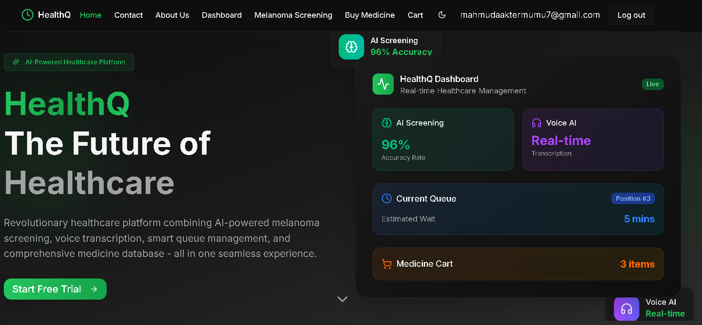

# 🩺 HealthQ  

  

**HealthQ** is an **AI-powered healthcare & diagnostic platform** that unifies:  
💊 Appointments • 🎥 Video Consultations • 📝 Audio-Transcribed Prescriptions • 🤖 Intelligent Queue Management • 🧪 Melanoma Detection • 🏪 Pharmacy Module  

---

## 🔗 Live URL  
👉 [healthq.vercel.app](https://healthq.vercel.app)  

---

## ✨ Features  

- 🔐 **Role-based Access** – Patients & doctors with secure authentication  
- 📅 **Appointment Booking** – Schedule and track visits effortlessly  
- 🤖 **ML Queue Management** – Reduce waiting times with AI predictions  
- 🎥 **Video Consultations** – Jitsi Meet integration for virtual care  
- 📝 **Smart Prescriptions** – Whisper-1 audio transcription → prescriptions  
- 🧪 **Disease Detection** – Early melanoma screening with deep learning  
- 💳 **Pharmacy & Payments** – Browse, buy & pay via **SSL Commerz**  

---

## 🛠️ Tech Stack  

**Frontend** → Next.js • TypeScript • Shadcn • Framer Motion  
**Backend** → Express.js • FastAPI (Python AI) • MongoDB  
**Authentication** → NextAuth  
**AI & ML** → Whisper-1 • Deep Learning (Queue + Melanoma Detection)  
**Payments** → SSL Commerz  

---

## 📂 Core Modules  

### 🔹 Appointments & Queue  
- Patients book appointments online  
- Intelligent ML queue ensures minimal waiting  

### 🔹 Consultations  
- Physical or virtual doctor-patient sessions  
- Jitsi Meet enables secure video calls  

### 🔹 Prescriptions  
- Audio consultations auto-transcribed with Whisper-1  
- Prescriptions generated in real-time  

### 🔹 Diagnostics  
- Upload skin images → AI melanoma detection  

### 🔹 Pharmacy  
- Buy medicines online with integrated checkout  

---

## 🚀 Getting Started  

### ✅ Prerequisites  
- [Node.js](https://nodejs.org/) (>=18.x)  
- [Python](https://www.python.org/) (>=3.10)  
- [MongoDB Atlas](https://www.mongodb.com/atlas) or local MongoDB  
- SSL Commerz merchant account  

### ⚙️ Installation  

```bash
# Clone the repository
git clone https://github.com/mumuuh6/HealthQ-client-side
cd healthq
```
### Install Dependencies
```bash
# Install frontend dependencies

npm install
```
## 🤝 Contribution  

We welcome contributions!  

1. Fork the repo  
2. Create a new branch (`feature/your-feature`)  
3. Commit your changes  
4. Open a pull request 🚀  

---

## ⚡ Developed with ❤️ by **Mumu**  

